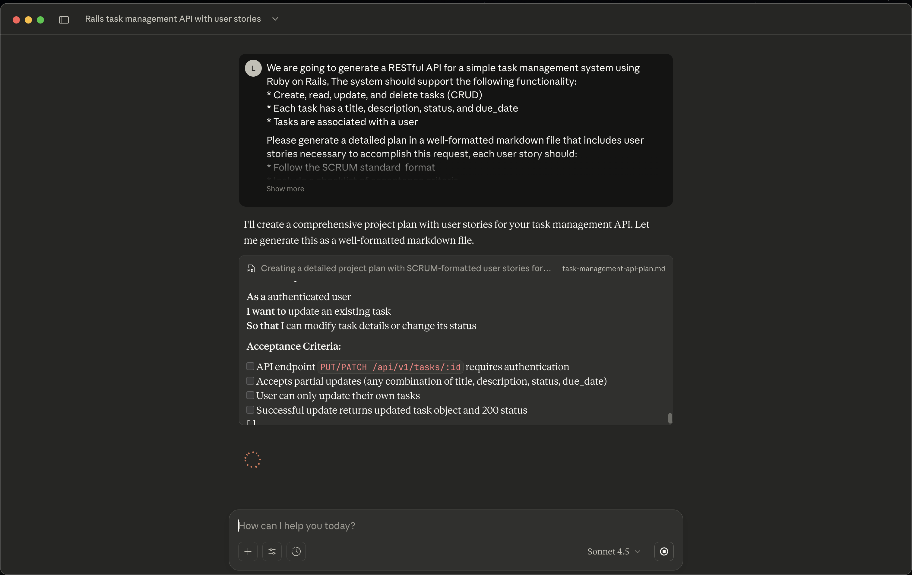
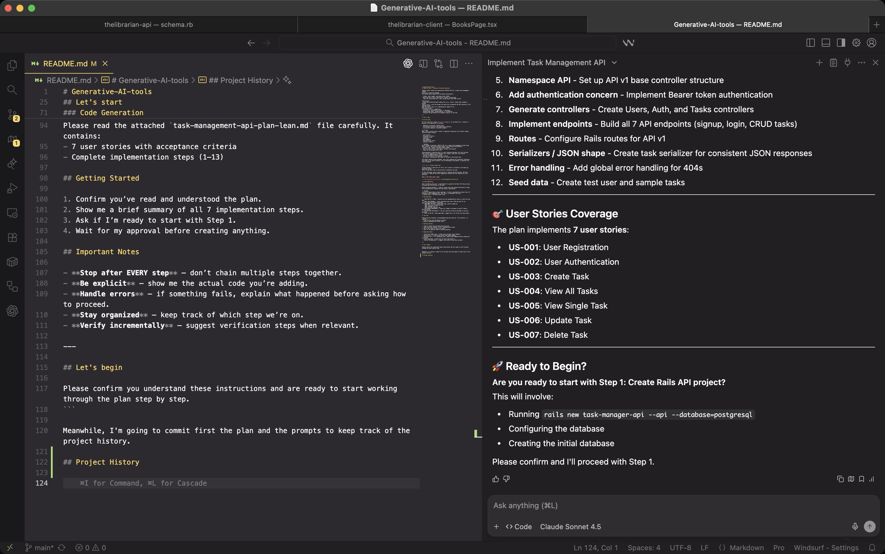
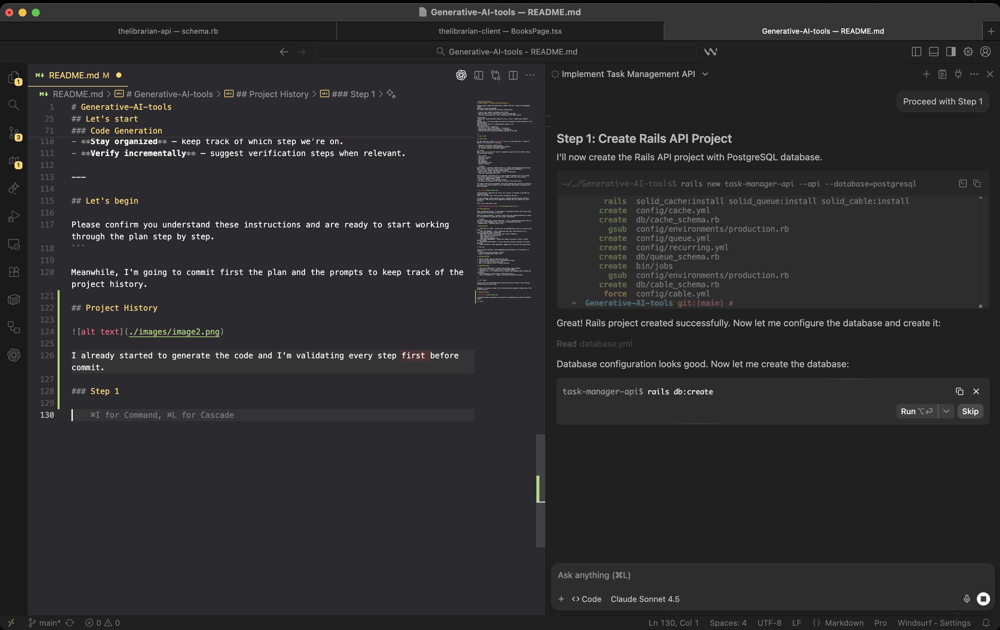
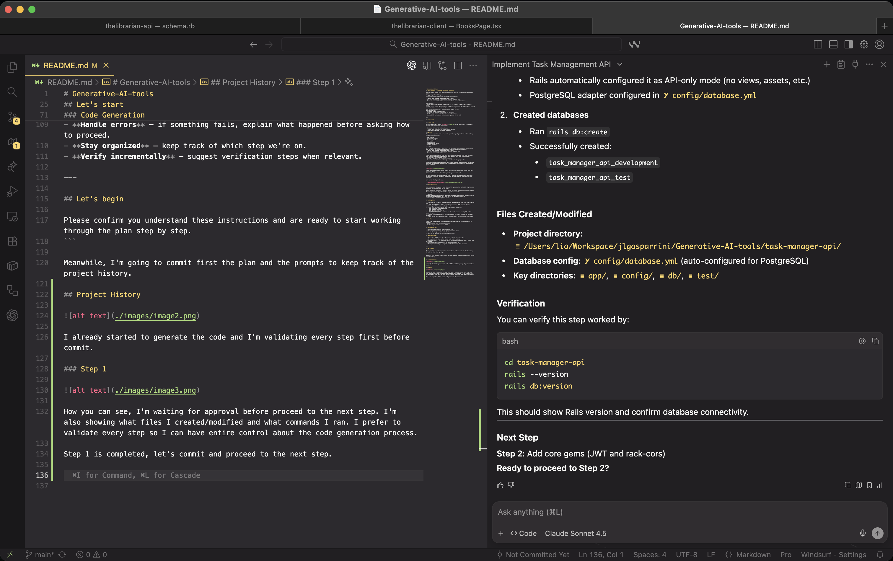
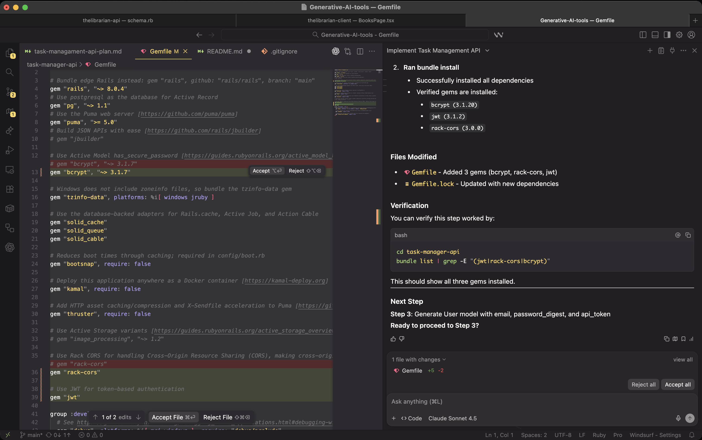
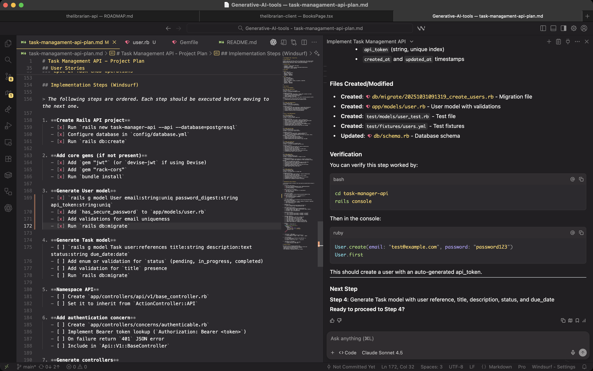
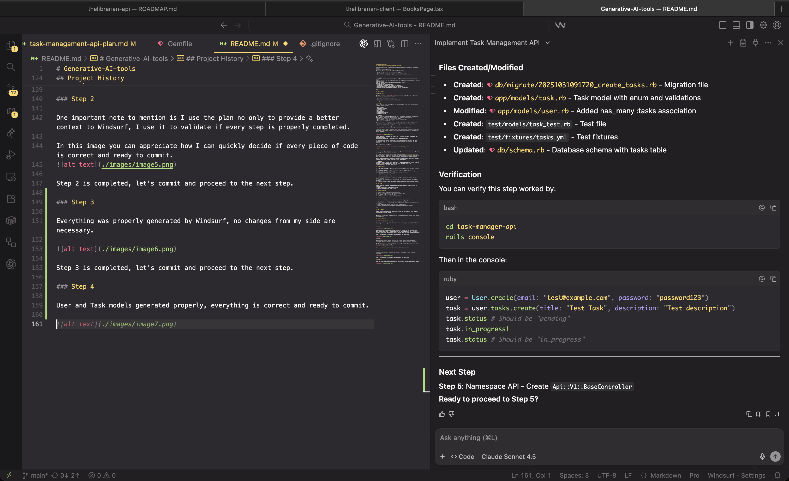

# Generative-AI-tools
## Ruby on Rails - Technical Interview Exercise

Imagine you’re tasked with generating a RESTful API for a simple task management system
using your preferred language.
The system should support the following functionality:

- Create, read, update, and delete tasks (CRUD)
- Each task has a title, description, status, and due_date
- Tasks are associated with a user (assume basic User model exists)

Instructions:
- Using your preferred GenAI coding tool (e.g., Cursor, Claude Code, Windsurf, GitHub
Copilot, etc.), write the prompt you would use to generate the API scaffold or full
implementation.
Show the output code (or a representative sample of it).
Describe how you:
- Validated the AI's suggestions
- Corrected or improved the output, if necessary
- Handled edge cases, authentication, or validations
- Assessed the performance and idiomatic quality of the code

---

## Let's start

### First step

For this exercise I choose [Claude AI](claude.ai) as my GenAI tool. I choose it because in my experience it provides:

- Generates structured, coherent code
- Follows best practices and common Rails patterns
- Can produce complete, validated examples

### Prompt
When I have a precise task I prefer to generate a good plan first before coding. The plan should include:

- User stories
- Acceptance criteria
- Technical stack
- Data model
- API Endpoints
- Implementation notes
- Success criteria

```markdown
We are going to generate a RESTful API for a simple task management system using Ruby on Rails, The system should support the following functionality:
* Create, read, update, and delete tasks (CRUD)
* Each task has a title, description, status, and due_date
* Tasks are associated with a user

Please generate a detailed plan in a well-formatted markdown file that includes user stories necessary to accomplish this request, each user story should:
* Follow the SCRUM standard  format
* Include a checklist of acceptance criteria
* Be concise, professional and ready to include in the project docs

The output should be pure markdown, with clear headings and consistent formatting and ready to be used by Windsurf (an AI development environment) to generate the entire codebase.
```



Claude generate a good plan for start, but I prefer to validate it and make any necessary change.
After review every step I used the plan to generate the code.

In this situation, before upload the plan I removed testing sections, API docs, validations, CORS and any extra suggestions because were not required for this exercise.

Here is the final plan I used:

- [task-managament-api-plan.md](./task-managament-api-plan.md) 

### Code Generation

After validating the plan, I used Windsurf to generate the Rails API step by step, following the instructions in the plan.

It's important to mention that in some situations I use [Warp](https://warp.dev) but not necessary to generate the code, in some situations I can take advantage of Warp and complete minor stuff without the need to consume all Windsurf credits.

Before prompting Windsurf, I usually review rules and context/constraints to keep the code generation aligned with the project requirements.

```markdown
You are an expert Ruby on Rails developer. I have a comprehensive project plan for building a Task Management API. Your job is to implement this plan **step-by-step**, following these rules:

## Working Rules

1. **ONE STEP AT A TIME**: Execute only one implementation step at a time from the plan.
2. **WAIT FOR APPROVAL**: After completing each step, STOP and wait for my explicit approval before proceeding.
3. **SHOW WHAT YOU DID**: After each step, clearly summarize:
   - What files you created/modified
   - What commands you ran
   - What the next step will be
4. **ASK BEFORE PROCEEDING**: Always ask "Ready to proceed to step X?" before moving forward.
5. **FOLLOW THE PLAN EXACTLY**: Use the code and structure provided in the plan document.
6. **TEST AS YOU GO**: When applicable, suggest how I can verify the step worked.

## The Plan

Please read the attached `task-management-api-plan-lean.md` file carefully. It contains:
- 7 user stories with acceptance criteria
- Complete implementation steps (1–13)

## Getting Started

1. Confirm you’ve read and understood the plan.
2. Show me a brief summary of all 7 implementation steps.
3. Ask if I’m ready to start with Step 1.
4. Wait for my approval before creating anything.

## Important Notes

- **Stop after EVERY step** – don’t chain multiple steps together.
- **Be explicit** – show me the actual code you’re adding.
- **Handle errors** – if something fails, explain what happened before asking how to proceed.
- **Stay organized** – keep track of which step we’re on.
- **Verify incrementally** – suggest verification steps when relevant.

---

## Let's begin

Please confirm you understand these instructions and are ready to start working through the plan step by step.
```

Meanwhile, I'm going to commit first the plan and the prompts to keep track of the project history.

## Project History



I already started to generate the code and I'm validating every step first before commit.

### Step 1



Now you can see, I'm waiting for approval before proceed to the next step. I'm also showing what files I created/modified and what commands I ran. I prefer to validate every step so I can have entire control about the code generation process.

Step 1 is completed, let's commit and proceed to the next step.



### Step 2

One important note to mention is I use the plan no only to provide a better context to Windsurf, I use it to validate if every step is properly completed.

In this image you can appreciate how I can quickly decide if every piece of code is correct and ready to commit.


Step 2 is completed, let's commit and proceed to the next step.

### Step 3

Everything was properly generated by Windsurf, no changes from my side are necessary.



Step 3 is completed, let's commit and proceed to the next step.

### Step 4

User and Task models generated properly, everything is correct and ready to commit.



Step 4 is completed, let's commit and proceed to the next step.
